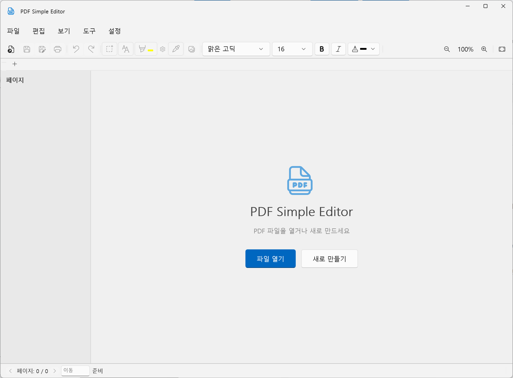

# PDF Simple Editor

A lightweight, powerful, and modern PDF editor built with **WinUI 3** and **.NET 10**. Powered by the **iText 9** engine, it provides a seamless experience for editing text, managing pages, and organizing PDF documents.



## 🚀 Features

### 📝 Precision Editing
- **Select & Move**: Click or drag to select text, `Alt+Drag` to move it. Fragmented characters are automatically grouped into sentences.
- **Edit in Place**: Double-click a text block to edit. Confirm with `Enter` (single-line) or `Ctrl+Enter` (multi-line); `Esc` or right-click also confirms.
- **Add Text**: Press `A` to switch to the Add Text tool, then add text with custom font family, size, color, bold, and italic.
- **Edit Modes**: Preserve the original text or replace it.
- **Images**: Insert images, save a selected image as a file, or extract all embedded images to a folder.

### 🖋️ Annotation & Highlighting
- **Smooth Highlighting**: Add semi-transparent highlights to text blocks.
- **Advanced Color Control**: Integrated color picker (eyedropper) and transparency sliders to customize highlight styles.
- **Signature Tool**: Draw, customize, select, move, resize proportionally, edit, and save mouse-drawn signatures for reuse after reopening the PDF.

### 📂 Document Management
- **Multi-Tab Interface**: Work on multiple PDF files simultaneously using a modern tabbed layout.
- **Page Operations**: Select multiple pages with `Ctrl`/`Shift`, reorder them, delete unnecessary pages, or extract selected pages into a new PDF.
- **Merge & Split**: Combine multiple PDF files into one or split specific page ranges into new documents.
- **Page Thumbnails**: Navigate and manage pages quickly using the interactive sidebar and its right-click menu.

### 🛠️ Modern UX/UI
- **WinUI 3 & Windows App SDK**: Native look and feel with fluent design elements.
- **Drag & Drop**: Open files instantly by dragging them into the application.
- **Text Search**: Powerful search functionality to find specific phrases within the document.
- **Keyboard Shortcuts**: 
  - `S`: Switch to **Select Tool**
  - `A`: Switch to **Add Text Tool**
  - `Ctrl+O`: Open File
  - `Ctrl+S`: Save File
  - `Ctrl+F`: Find Text

## 🛠️ Technology Stack
- **Framework**: .NET 10.0
- **UI Framework**: WinUI 3 (Windows App SDK)
- **PDF Engine**: iText 9.0 (Core, PdfSweep, BouncyCastle)
- **Language**: C#

## ⚙️ Installation

### 📥 Download
You can download the latest version from the [Releases Page](https://github.com/kirinonakar/PDF_simple_edit/releases).

### Prerequisites
- Windows 10/11 (version 19041 or higher)
- [.NET 10 SDK](https://dotnet.microsoft.com/download)

### Build from Source
1. Clone the repository:
   ```bash
   git clone https://github.com/kirinonakar/PDF_simple_edit.git
   ```
2. Open the solution in Visual Studio 2022 (or later).
3. Restore NuGet packages.
4. Build and run the `PDF_simple_edit` project.

## 📄 License
This project is licensed under the GNU Affero General Public License v3.0 - see the [LICENSE](LICENSE) file for details.